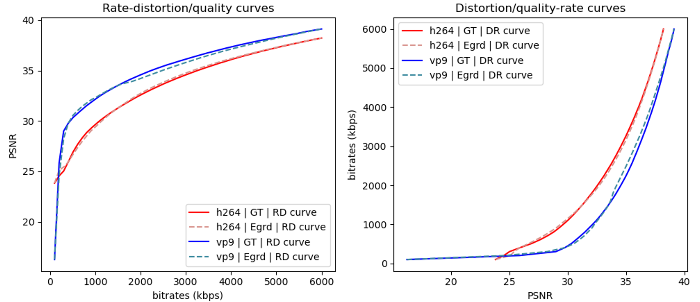
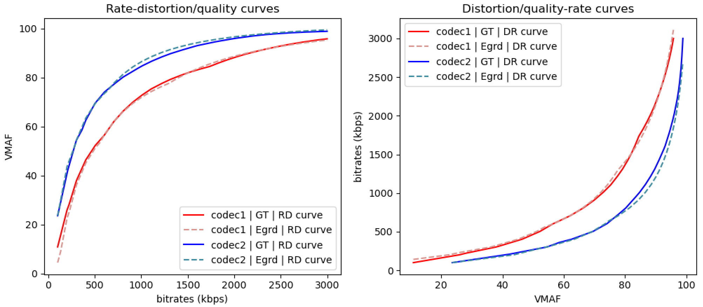

Rate and Distortion: A toolkit for video codec comparison
=========================================================

.. intro-section-start

R&D is a Python library that faciliates multimedia codec comparison. It provides functions to perform rate-distortion analysis for a given codec with sparse samples in the rate-distortion space.

.. intro-section-end

.. feature-section-start

========
Features
========

* Efficiency: R&D provides the implementation of state-of-the-art rate-distortion function models, which enables efficient codec comparison with only sparse encoding samples.
* Accuracy: R&D is demonstrated to be more accuracy than the traditional BD-rate measure.
* Flexibility: R&D can be applied to analyze the encoder performance at different resolution, frame rate, and bit depth, with a unified interface.
* Robustness: R&D curve/surface fitting models are mathematically stable.
* Generalizability: R&D is compatible with most of the modern video quality assessment models such as PSNR, VMAF, and SSIMPlus.
* Extrapolation Capability: R&D can deliver reasonable codec performance analysis in the region where no encoding samples are provided.

.. feature-section-end

.. installation-section-start

============
Installation
============

`R&D <https://github.com/UWIVC/randd>`_ can be installed using ``pip`` or from source.

Install from source:

.. code-block:: sh

    $ git clone git@github.com:UWIVC/randd.git
    $ python setup.py install

Install from pip:

.. code-block:: sh

    $ pip install randd

.. installation-section-end

.. usage-example-start

============
Sample Usage
============

1D Example
----------
The following example illustrates how to use R&D to compare two video codecs with distortion measure being PSNR:

.. code-block:: python

    import randd as rd
    import numpy as np

    r1 = np.array([100., 400., 1500., 6000.])
    d1 = np.array([23.83, 25.89, 31.28, 38.22])
    r2 = np.array([100., 400., 1500., 6000.])
    d2 = np.array([16.25, 29.75, 33.52, 39.12])
    analyzer = rd.Analyzer(d_measure='psnr')
    quality_gain, bitrate_saving, summary = analyzer(r1, d1, r2, d2, codec1='h264', codec2='vp9')

2D Example
----------
The following example illustrates how to use R&D to compare two video codecs with distortion measure being VMAF. We can also specify the bitrate region [100, 3000] to compute the quality gain. Note that R&D can perform reasonable extrapolation to the region where no RD samples are given.

.. code-block:: python

    import randd as rd
    import numpy as np

    # 1st dim: bitrate, 2nd dim: diagonal size of spatial resolution
    r1 = np.array([[2400.,  400.], [1700.,  865.], [ 300., 1469.], [2100., 2203.]])
    d1 = np.array([28.39, 71.87, 26.98, 89.35])
    r2 = np.array([[2400.,  400.], [1700.,  865.], [ 300., 1469.], [2100., 2203.]])
    d2 = np.array([28.86, 75.03, 54.35, 96.49])
    analyzer = rd.Analyzer(d_measure='vmaf', ndim=2, r_roi=[100, 3000])
    quality_gain, bitrate_saving, summary = analyzer(r1, d1, r2, d2, codec1='h264', codec2='vp9')

Backward Compatibility
----------------------
R&D also provides implementation of traditional codec comparison tools such as BD-rate:

.. code-block:: python

    import randd as rd
    import numpy as np
    from randd.model import LogCubic

    r1 = np.array([100., 400., 1500., 6000.])
    d1 = np.array([23.83, 25.89, 31.28, 38.22])
    r2 = np.array([100., 400., 1500., 6000.])
    d2 = np.array([16.25, 29.75, 33.52, 39.12])
    analyzer = rd.Analyzer(d_measure='psnr', model1=LogCubic, model2=LogCubic)
    quality_gain, bitrate_saving, summary = analyzer(r1, d1, r2, d2, codec1='h264', codec2='vp9')

.. image:: docs/source/_static/example3.png

.. usage-example-end

=============
Documentation
=============

The full documentation is available at `<https://randd.readthedocs.io/>`_.

.. citation-section-start

========
Citation
========
We are making R&D publicly available. If you use R&D in your project, we kindly ask you to cite the following paper:

.. code-block:: tex

    @article{duanmu2020egrd,
        title={Characterizing Generalized Rate-Distortion Performance of Video Coding: An Eigen Analysis Approach},
        author={Duanmu, Zhengfang and Liu, Wentao and Li, Zhuoran and Ma, Kede and Wang, Zhou},
        journal={IEEE Transactions on Image Processing},
        volume={29},
        number={},
        pages={6180-6193},
        year={2020}
    }

.. citation-section-end

.. contact-section-start

========
Contacts
========

**Wentao Liu** - `@w238liu <https://ece.uwaterloo.ca/~w238liu>`_ - ``w238liu@uwaterloo.ca``

**Zhengfang Duanmu** - `@zduanmu <https://ece.uwaterloo.ca/~zduanmu>`_ - ``zduanmu@uwaterloo.ca``

.. contact-section-end