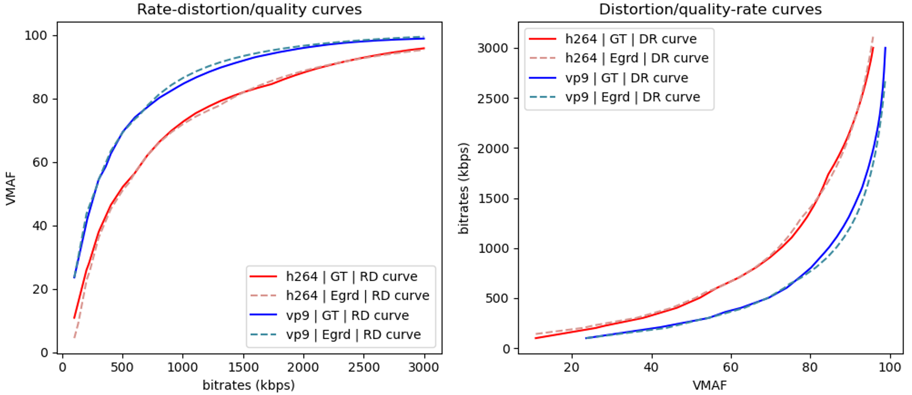

============
Sample Usage
============

1D Example
----------
The following example illustrates how to use R&D to compare two video codecs with distortion measure being PSNR:

.. code-block:: python

    import randd as rd
    import numpy as np

    r1 = np.array([100., 400., 1500., 6000.])
    d1 = np.array([23.83, 25.89, 31.28, 38.22])
    r2 = np.array([100., 400., 1500., 6000.])
    d2 = np.array([16.25, 29.75, 33.52, 39.12])
    analyzer = rd.Analyzer(d_measure='psnr')
    quality_gain, bitrate_saving, summary = analyzer(r1, d1, r2, d2, codec1='h264', codec2='vp9')

.. image:: _static/example1.png

2D Example
----------
The following example illustrates how to use R&D to compare two video codecs with distortion measure being VMAF. We can also specify the bitrate region [100, 3000] to compute the quality gain. Note that R&D can perform reasonable extrapolation to the region where no RD samples are given.

.. code-block:: python

    import randd as rd
    import numpy as np

    # 1st dim: bitrate, 2nd dim: diagonal size of spatial resolution
    r1 = np.array([[2400.,  400.], [1700.,  865.], [ 300., 1469.], [2100., 2203.]])
    d1 = np.array([28.39, 71.87, 26.98, 89.35])
    r2 = np.array([[2400.,  400.], [1700.,  865.], [ 300., 1469.], [2100., 2203.]])
    d2 = np.array([28.86, 75.03, 54.35, 96.49])
    analyzer = rd.Analyzer(d_measure='vmaf', ndim=2, r_roi=[100, 3000])
    quality_gain, bitrate_saving, summary = analyzer(r1, d1, r2, d2, codec1='h264', codec2='vp9')

Backward Compatibility
----------------------
R&D also provides implementation of traditional codec comparison tools such as BD-rate:

.. code-block:: python

    import randd as rd
    import numpy as np
    from randd.model import LogCubic

    r1 = np.array([100., 400., 1500., 6000.])
    d1 = np.array([23.83, 25.89, 31.28, 38.22])
    r2 = np.array([100., 400., 1500., 6000.])
    d2 = np.array([16.25, 29.75, 33.52, 39.12])
    analyzer = rd.Analyzer(d_measure='psnr', model1=LogCubic, model2=LogCubic)
    quality_gain, bitrate_saving, summary = analyzer(r1, d1, r2, d2, codec1='h264', codec2='vp9')

.. image:: _static/example3.png